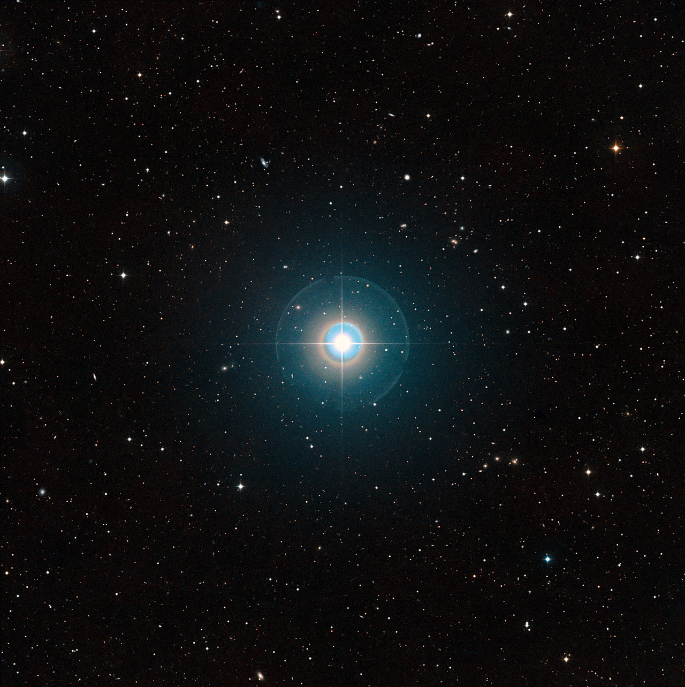

# sql-finetune: text-to-SQL on a custom exoplanets database

    
    
<em>Tau Boötis b, Source: European Southern Observatory, CC BY 2.0 image</em>

- The goal is to fine tune smaller LLMs on a specific database to get the models used to domain-specific language, adhere better to sqlite standard, and generate SQL that would answer questions about the database with increased accuracy.
  
- A small custom dataset of 50 training examples and 10 validation examples was created based on https://www.kaggle.com/datasets/adityamishraml/nasaexoplanets/data. sqlite table exoplanets was made from the data, along with a reference_planets table made by inserting (name, mass) VALUES ('Jupiter', 1.898e27) and (name, mass) VALUES ('Earth', 5.972e24). The mass_wrt column in exoplanets maps to the mass column in reference_planets, allowing for more complex queries involving joins.  The data is now available at dpv/exoplanets-sql.
  
- Fine premai-io/prem-1B-SQL: execution rate is 70-80% (up from 50%) and accuracy is around 30% (up from 10%) with premsql within 10 epochs/2 minutes of fine tuning all of the model weights in full precision.  The big unknown is exact the prompt format used by premsql, which I could not exactly determine.  Perhaps fixing this could lead to much better results.
  
- Fine tuning meta-llama/Llama-3.2-3B-Instruct with LoRA: execution rate starts at 80-90% percent for the original model, but the results are not accurate (no full matches, but did not investigate close matches). After fine tuning on the exoplanets data set, which took less than 2 minutes, got 90% execution rate and 70% result accuracy (with affordances granted to difference in column names/multiple ways to interpret one of the questions).  In addition, the original model with weights in full precision took over 6.5 minutes to generate 10 queries whereas the fine tuned LoRA version took 12 seconds per 10 queries.
